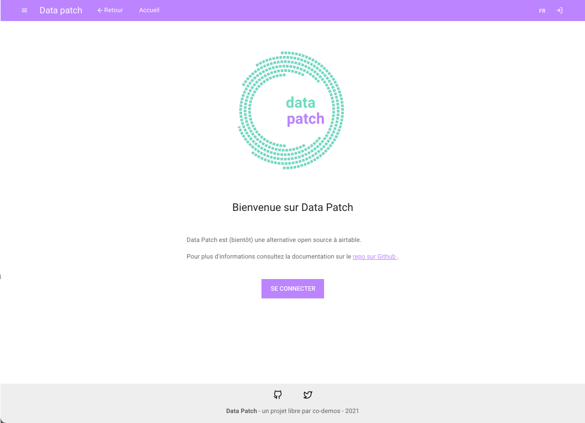
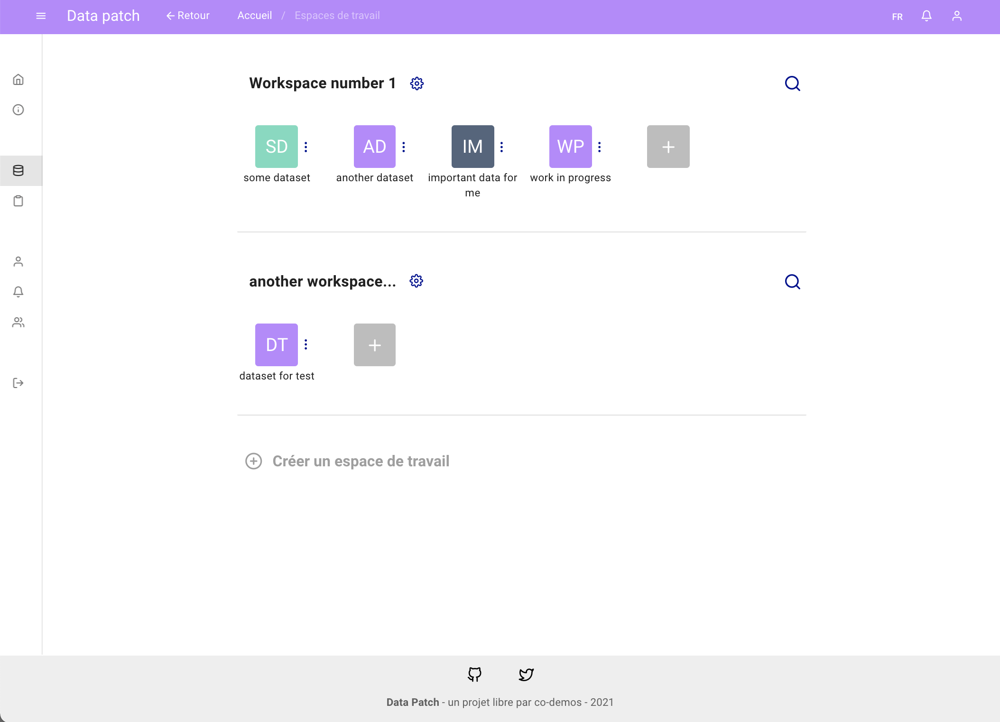

# DATA PATCH - FRONTEND

Frontend interface for the API server **[data patch backend][datapatch-back]**. The backend is mainly for [CRUD][CRUD_def] and auth operations, powered by **[FastAPI][fastapi]** framework with a **PostgreSQL** database. 

This frontend is developped as an SPA (client-only) app, so it could be developped and maintained completely appart from the backend.

## Features

The current goal is to make it work with the following generic features, so it could be adapted for later purposes :

- [x] **Authentication** pages & components : login + renew password + middlewares
- [x] **Internationalization** with i18n
- [x] **Workspaces** pages & components (current) : list of datasets + meta
- [x] **Datasets** pages & components
- [x] **Tables** pages & components
- [ ] **Schemas** pages & components
- [ ] **Fields** pages & components
- [x] **Groups** pages & components
- [ ] **Comments** pages & components
- [ ] **Notifications** pages & components
- [ ] **Invitations** pages & components
- [ ] **Chat & collaboration on datasets** socketiio & components
- [ ] **Documentation** pages & components


## Stack

- Vue.js + Nuxt.js
- Vuetify
- Axios (@nuxt/axios)
- Cookie-universal-nuxt
- i18n
- vuedraggable
- GSAP
- SocketIo || Yjs (not implemented yet)


## Installation

```bash
# install dependencies
cd frontend
nvm use
npm install
```

## Run app

```bash
# serve with hot reload at localhost:5000
cd frontend
nvm use
npm run dev
```

You should have something like this :



<br>




## Build setup

```bash
# build for production and launch server
npm run build
npm run start

# generate static project
npm run generate

# analyze
npm run analyze
```

---


[datapatch-back]:https://github.com/co-demos/fastapi-boilerplate

[CRUD_def]:https://en.wikipedia.org/wiki/Create,_read,_update_and_delete
[fastapi]:https://fastapi.tiangolo.com/
[fastapi-tuto]:https://fastapi.tiangolo.com/tutorial/
[fastapi-boilerplate]:https://github.com/tiangolo/full-stack-fastapi-postgresql
[MK-fast]:https://www.youtube.com/watch?v=HnJEiTx0feE&list=PL_9Bx_sxJkROtrlVTsGiuu-NtO_BmUfkB

[pipenv]:https://pipenv-fork.readthedocs.io/en/latest/basics.html
[alembic]:https://alembic.sqlalchemy.org/en/latest/
[pytest]:https://docs.pytest.org/en/stable/
[fastapi-tests]:https://fastapi.tiangolo.com/tutorial/testing/

[roadmap-beta]:https://github.com/co-demos/fastapi-boilerplate/projects/1

[baserow]:https://baserow.io/
[airtable]:https://airtable.com/
